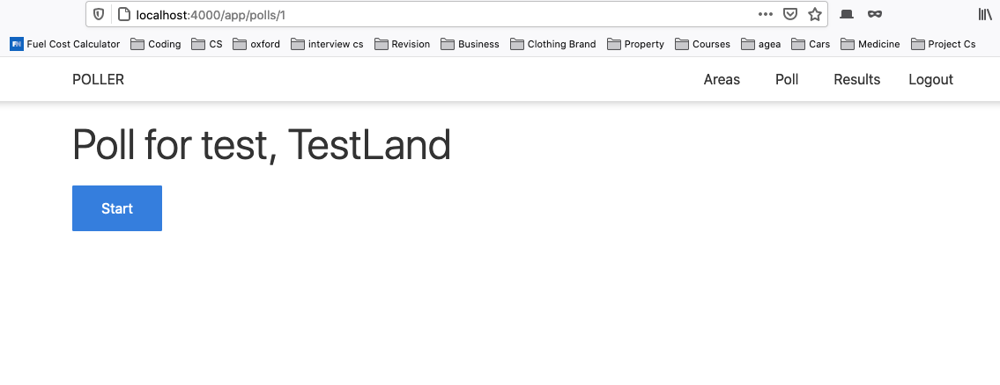

# Polling web application (Elixir, Phoenix, React js)
A single page exiting polling web applcation using: postgres, react js, elixir and pheonix.
Site link: (I unfortunately ran out of credits...)

#### An exit polling web application which allows users to login and create polls (admin only) which are shown on a dynamic results page (avaible to all users). The results page updates in real time. Build as part of my NEA for computer sciecne A level and recieved an A*.

### The primamry purpose of this project is to learn and practice concepts related to:
> - Building a REST API
> - Elxir lang
> - Phoenix web frame work
> - React js front end
> - MVC Architectural Pattern
> - full stack deveopment
> - Sibling project intergration

#### More specifically, I used the following:
> - OTP + Actor model
> - Ecto Database library (ECTO - Repo, Schema, ChangeSet, Query)
> - Repository design pattern
> - PostgreSQL relational database (CRUD)
> - Argon2 password hashing encryption
> - User access control (auth plugs)
> - RESTful API guidelines
> - HTTP (GET, POST, PUT, PATCH, DELETE, status codes)
> - Phoenix channels (persistant web stocket connection)
> - PubSub 
> - Testing API Endpoints (SwaggerUI & Postman)

*Note: Please excuse the large comments in my code, they were used as notes for my NEA write up later.*

### Application Slibing Architecture:

### State is accessed via genservers to reduce creating bottle neck from DB queries, architecture below saves state from gen-servers to db using a scheduler to prevent loss of votes in cash.

### Real time Pubsub + Pheonix webstock channels:

 

#### Creates real time update for subscribed clients every time a vote is clicked in a poll

### Website Look:
#### Home:

#### Poll Areas CRUD:

#### Poll questions CRUD:

#### Poll choice CRUD:

#### Take Poll:

#### Real-time results:

### Access control 

### User login Validation

